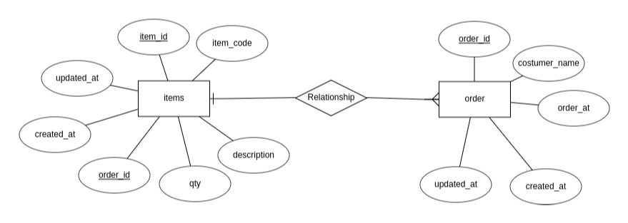

# Hacktiv8 x MSIB - Order App

Name : Yusril Ilham Kholid

No. Peserta : GLNG-KS07-04

## Entity Relationship Diagram


## Swagger UI


## Setup .env file
```
DB_USER=
DB_PASSWORD=
DB_NAME=
DIALECT=
PORT=
```

## Endpoints
| No. | Method |        Path        |       Description        |
|-----|--------|--------------------|--------------------------|
| 1   | POST   |  /orders           | Create new order         |
| 2   | GET    |  /orders           | Get all orders           |
| 3   | PUT    |  /orders/{id}      | Update order by order id |
| 4   | DELETE |  /orders/{id}      | Delete order by order id |

## Create Order
Body request :
```json
{
  "customerName": "An Yujin",
  "items": [
    {
      "description": "Indomie Goreng",
      "itemCode": "indomiegr",
      "quantity": 2
    }
  ],
  "orderedAt": "2023-09-22T09:11:00+07:00"
}
```

## Update Order
Param required : 
```
orderId int
```

Body request : 
```json
{
  "customerName": "An Yujin",
  "items": [
    {
      "description": "Indomie Goreng",
      "itemCode": "indomiegr",
      "quantity": 3
    }
  ],
  "orderedAt": "2023-09-22T09:11:00+07:00"
}
```

## Run Application
```sh
  $ go run main.go
```

http://localhost:8080/swagger/index.html
